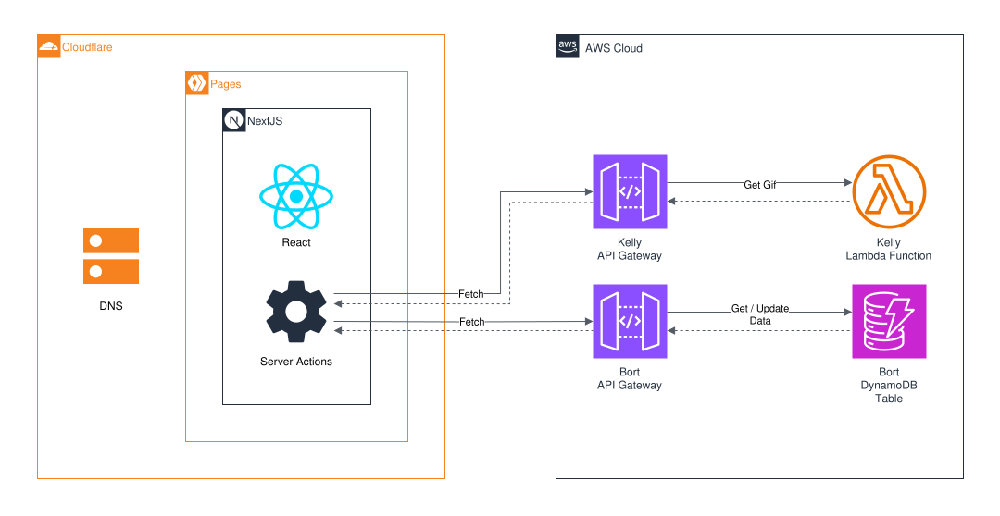

# Website

Code for my personal website [alsmith.dev](https://alsmith.dev).

## Running locally

1. Install the following dependenices

   ```bash
   sudo apt install curl git gifsicle
   snap install aws-cli --classic
   ```

1. Install asdf

   ```bash
   git clone https://github.com/asdf-vm/asdf.git ~/.asdf --branch v0.14.0
   # using ohmyzsh plugin
   sed -i 's/^plugins=(\(.*\))/plugins=(\1 asdf)/' ~/.zshrc
   ```

1. Install asdf plugins

   ```bash
   asdf plugin-add nodejs
   asdf plugin-add pnpm
   ```

1. Install tools

   ```bash
   asdf install
   ```

1. Install packages

   ```bash
   pnpm install
   ```

## Deployment

`apps/web` deploys to Cloudflare Workers with static assets. `vite build`
emits the client bundle to `dist/client` and the Worker to
`dist/website_frontend`; `wrangler deploy` then uploads both.

Pull requests upload a new Worker version aliased to the branch name, which
gets its own preview URL without shifting production traffic. Merges to
`main` deploy that version to production.

### Cutting the live domain over to the Worker

`alsmith.dev` still resolves to the old `website-frontend` **Pages** project.
Deploying the Worker does not move it. To cut over, uncomment the `routes`
entry in `apps/web/wrangler.jsonc`, deploy, confirm the Worker is serving the
domain, then delete the Pages project.

The `CLOUDFLARE_API_TOKEN` secret also needs the *Workers Scripts: Edit*
permission, which the old Pages-scoped token may not have.

## Architecture


